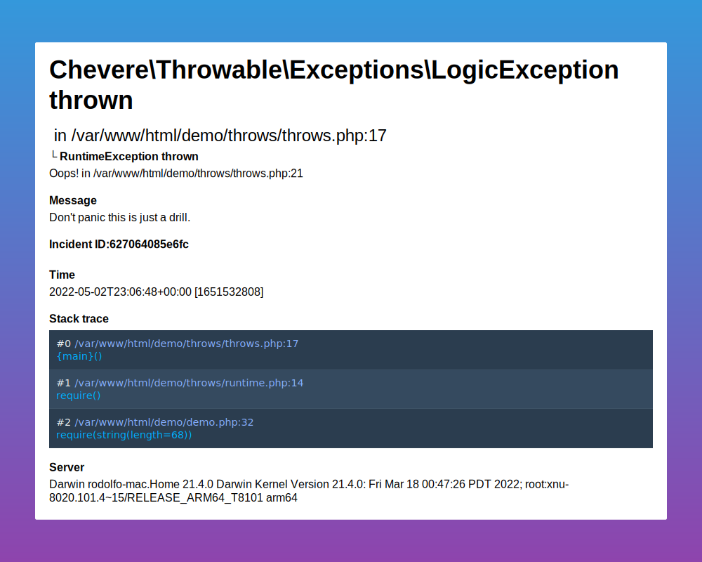

# ThrowableHandler

> 🔔 Subscribe to the [newsletter](https://chv.to/chevere-newsletter) to don't miss any update regarding Chevere.


[](https://github.com/chevere/throwable-handler/actions)

[](LICENSE)
[](https://phpstan.org/)
[](https://dashboard.stryker-mutator.io/reports/github.com/chevere/throwable-handler/0.11)

[](https://sonarcloud.io/dashboard?id=chevere_throwable-handler)
[](https://sonarcloud.io/dashboard?id=chevere_throwable-handler)
[](https://sonarcloud.io/dashboard?id=chevere_throwable-handler)
[](https://sonarcloud.io/dashboard?id=chevere_throwable-handler)
[](https://sonarcloud.io/dashboard?id=chevere_throwable-handler)
[](https://sonarcloud.io/dashboard?id=chevere_throwable-handler)
[](https://www.codefactor.io/repository/github/chevere/throwable-handler)
[](https://app.codacy.com/gh/chevere/throwable-handler/dashboard)


## Quick start

Install ThrowableHandler using [Composer](https://getcomposer.org).

```sh
composer require chevere/throwable-handler
```

Register ThrowableHandler to handle all errors.

```php
use Chevere\ThrowableHandler\ThrowableHandler;

set_error_handler(ThrowableHandler::ERROR_AS_EXCEPTION);
register_shutdown_function(ThrowableHandler::SHUTDOWN_ERROR_AS_EXCEPTION);
```

Register your exception handler, you can choose:

* `ThrowableHandler::PLAIN`
* `ThrowableHandler::CONSOLE`
* `ThrowableHandler::HTML`

```php
use Chevere\ThrowableHandler\ThrowableHandler;

set_exception_handler(ThrowableHandler::PLAIN);
```

## Demo



* [HTML](https://chevere.github.io/throwable-handler/demo/output/html.html)
* [HTML (silent)](https://chevere.github.io/throwable-handler/demo/output/html-silent.html)
* [Plain text](https://chevere.github.io/throwable-handler/demo/output/plain.txt)
* [Console (asciinema)](https://asciinema.org/a/491732)

## Documentation

Documentation is available at [chevere.org](https://chevere.org/packages/throwable-handler).

## License

Copyright 2023 [Rodolfo Berrios A.](https://rodolfoberrios.com/)

Chevere is licensed under the Apache License, Version 2.0. See [LICENSE](LICENSE) for the full license text.

Unless required by applicable law or agreed to in writing, software distributed under the License is distributed on an "AS IS" BASIS, WITHOUT WARRANTIES OR CONDITIONS OF ANY KIND, either express or implied. See the License for the specific language governing permissions and limitations under the License.
